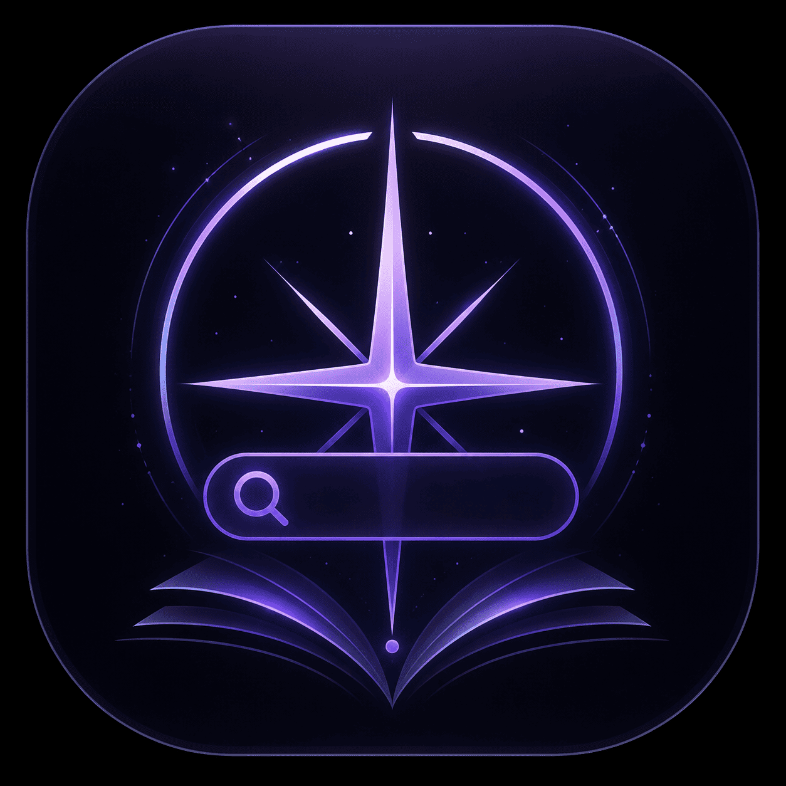
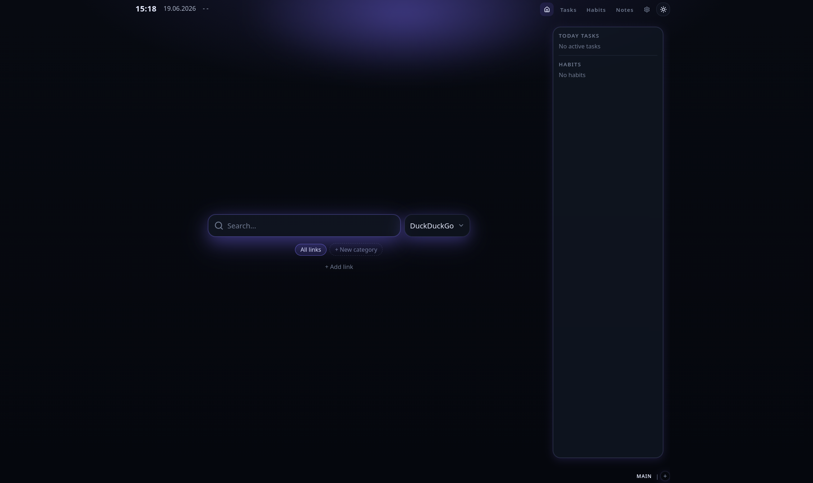
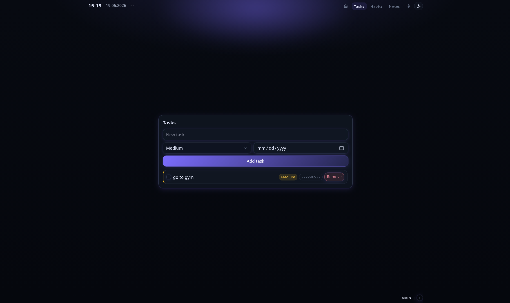
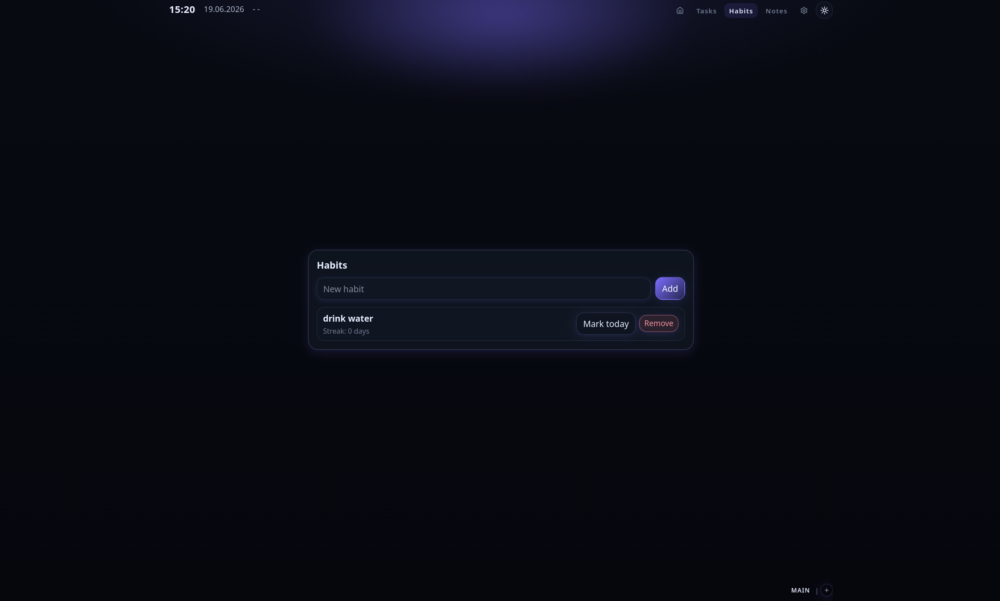
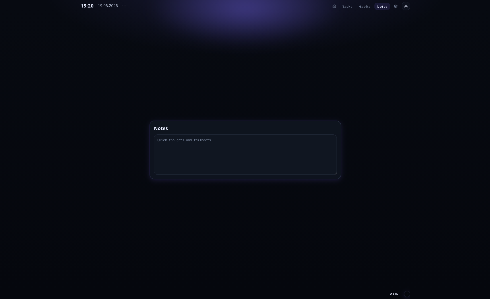
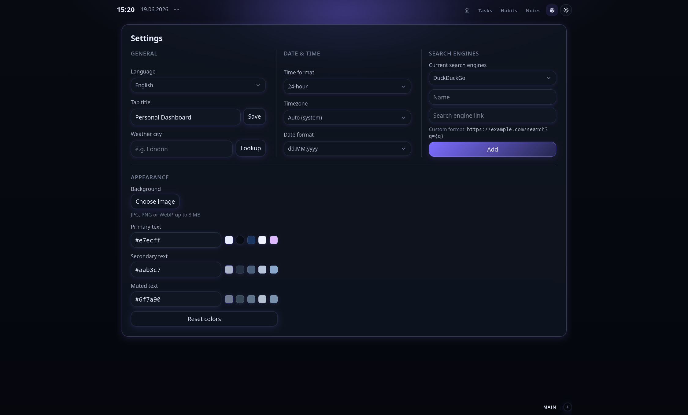
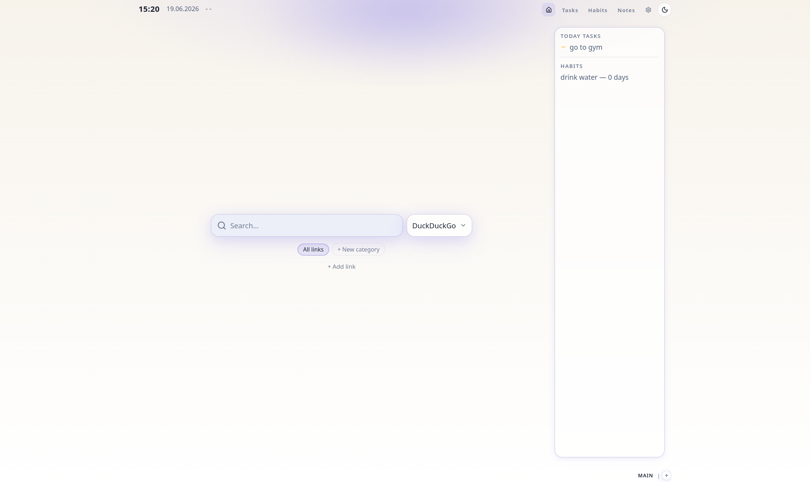

  <a href="../README.md">English</a> | <strong>Русский</strong>

  
  <h1>Browser Dashboard</h1>

  
<strong>Быстрая оффлайн-first стартовая страница браузера с поиском, задачами, привычками и закладками.</strong>

  

    
    
    
    
    
    
    
    
    
  

## Возможности

- 🔍 Поиск с несколькими движками
- 📁 Категории закладок
- ✅ Менеджер задач
- 🔥 Трекер привычек
- 📝 Заметки
- 🌤 Погода
- 🗂 Рабочие пространства
- 💾 Оффлайн-first хранение
- 🚫 Без регистрации

## Содержание

- [Возможности](#возможности)
- [Что это](#что-это)
- [Для чего](#для-чего)
- [Какую проблему решает](#какую-проблему-решает)
- [Функционал и как он работает](#функционал-и-как-он-работает)
- [Установка](#установка)
- [Как подключить в браузере](#как-подключить-в-браузере)
- [Ограничения](#ограничения)
- [Скриншоты](#скриншоты)
- [Roadmap](#roadmap)
- [Для разработчиков](#для-разработчиков)
- [Лицензия](#лицензия)

---

### Что это

**Browser Dashboard** — локальная стартовая страница браузера в виде одного файла `index.html`. Приложение работает целиком в браузере, без сервера и без аккаунта.

Интерфейс заточен под скорость и минимализм: поиск, закладки, задачи, привычки, заметки, часы и погода — на одном спокойном экране с тёмной атмосферной эстетикой.

### Для чего

Используйте её как домашний экран при запуске браузера или открытии новой вкладки. Вместо стандартной страницы поисковика получаете своё рабочее пространство: ваши ссылки, задачи, привычки и настройки — всё хранится локально на вашем компьютере.

### Какую проблему решает

Встроенные стартовые страницы часто перегружены, однотипны или привязаны к одному поисковику. Облачные дашборды требуют регистрации, синхронизации и постоянного интернета.

Browser Dashboard — компромисс между простотой и пользой:

- **Локальность** — данные остаются в браузере (IndexedDB), а не на чужом сервере.
- **Один файл** — скачали релиз, указали путь в браузере, готово.
- **Быстрый отклик** — статическая сборка без фоновых служб и установщиков.
- **Практичный набор** — поиск, быстрые ссылки, обзор дня и лёгкие виджеты продуктивности на одном экране.

### Функционал и как он работает

| Раздел                   | Что даёт                                        | Как работает                                                                                                                                                                                              |
| ------------------------ | ----------------------------------------------- | --------------------------------------------------------------------------------------------------------------------------------------------------------------------------------------------------------- |
| **Рабочие пространства** | Отдельные контексты (*Работа*, *Личное* и т.д.) | У каждого workspace свои задачи, привычки, закладки и заметка. Переключение — в нижней панели; активное пространство запоминается.                                                                        |
| **Поиск**                | Центральная строка с выбором движка             | Google и DuckDuckGo из коробки, плюс свои движки через шаблон URL с `{q}`. Запрос открывается в новой вкладке. История хранится локально; онлайн-подсказки — через Google Suggest (JSONP), если доступны. |
| **Быстрые ссылки**       | Сетка закладок с категориями                    | Сохранение URL с названием, группировка по категориям, фильтр на главном экране.                                                                                                                          |
| **Задачи**               | Полный список todo с приоритетами и дедлайнами  | Добавление, выполнение, сортировка и удаление. На главной в боковой панели — до пяти активных задач.                                                                                                      |
| **Привычки**             | Трекер с сериями (streak)                       | Отметка выполнения за сегодня; длина серии считается по истории дат.                                                                                                                                      |
| **Заметки**              | Одна заметка на workspace                       | Текстовое поле с автосохранением; экран подгружается лениво.                                                                                                                                              |
| **Часы и дата**          | Время и дата в верхней панели                   | Формат 12/24 ч, часовой пояс (авто или вручную), локализованный формат даты.                                                                                                                              |
| **Погода**               | Температура в верхней панели                    | Город геокодируется через Open-Meteo; прогноз запрашивается по необходимости и кэшируется на 30 минут. Нужен интернет.                                                                                    |
| **Настройки**            | Тема, язык, внешний вид, поиск, погода          | Светлая/тёмная тема, русский/английский UI, фон, цвета текста, заголовок вкладки, управление поисковыми движками.                                                                                         |
| **Хранение**             | Оффлайн-персистентность                         | Все основные данные — в IndexedDB через Dexie (`browser-home-page-db`). Без аккаунта и облачной синхронизации.                                                                                            |

### Установка

1. Откройте [GitHub Releases](https://github.com/NameNotImportantt/browser-dashboard/releases).
2. Скачайте актуальный `index.html` из assets релиза.
3. Сохраните файл в удобное место, например:
  - Linux: `~/Documents/browser-dashboard/index.html`
  - macOS: `~/Documents/browser-dashboard/index.html`
  - Windows: `C:\Users\You\Documents\browser-dashboard\index.html`

> [!IMPORTANT]
> В каждом релизе лежит **один самодостаточный файл `index.html`**. JavaScript, стили и ресурсы встроены при сборке — для использования не нужны Node.js, Bun или сервер.

Никаких пакетных менеджеров, сборки и зависимостей для конечного пользователя не требуется.

### Как подключить в браузере

> [!NOTE]
> **В работе.** Документация по подключению в браузеры дополняется и проверяется. Шаги ниже — черновик.

Укажите URL вида `file:///` на скачанный файл. Или откройте файл с помощью браузера.

**Примеры путей**

| ОС      | Пример URL `file:///`                                         |
| ------- | ------------------------------------------------------------- |
| Linux   | `file:///home/you/Documents/browser-dashboard/index.html`     |
| macOS   | `file:///Users/you/Documents/browser-dashboard/index.html`    |
| Windows | `file:///C:/Users/You/Documents/browser-dashboard/index.html` |

#### Blink (Chrome, Chromium, Brave, Edge, Vivaldi, Opera)

**Стартовая страница при запуске**

1. Откройте **Настройки** браузера.
2. Найдите раздел **При запуске** / **On startup**.
3. Выберите **Открыть конкретную страницу или набор страниц**.
4. Добавьте `file:///` URL на ваш `index.html`.

**Новая вкладка (опционально)**

В браузерах на Blink нельзя штатно заменить страницу новой вкладки локальным файлом. Варианты:

- расширение для переопределения new tab с указанием локального файла;
- использовать только стартовую страницу при запуске браузера.

#### Gecko (Firefox, LibreWolf, Zen и др.)

**Домашняя страница и новые окна**

1. **Настройки → Домашняя страница** (или `about:preferences#home`).
2. В поле **Домашняя страница и новые окна** выберите **Указать URL…**.
3. Вставьте ваш `file:///` URL.

**Новая вкладка (опционально)**

1. Откройте `about:config`.
2. Задайте `browser.newtab.url` равным вашему `file:///` URL.

> [!TIP]
> Храните файл в постоянной папке. Если перенесёте или переименуете его — обновите путь в настройках браузера.

### Ограничения

- **Только локальные данные** — задачи, привычки, закладки, заметки и настройки лежат в IndexedDB текущего профиля браузера. Очистка данных сайта удалит всё. Встроенного экспорта, импорта и синхронизации между устройствами нет.
- **Один профиль браузера = один набор данных** — данные не переносятся между браузерами на Blink и Gecko; разные профили одного браузера — тоже.
- **Погода требует сеть** — геокодинг и прогноз идут через API Open-Meteo. Без интернета показывается только последний кэш (до 30 минут).
- **Онлайн-подсказки поиска требуют сеть** — запросы к Google Suggest через JSONP. Блокировщики рекламы, жёсткие настройки приватности или оффлайн отключают их; локальная история поиска работает.
- **Фон хранится локально** — загруженное изображение сжимается и сохраняется в IndexedDB (исходник до 8 МБ, длинная сторона до 1920 px).
- **Одна заметка на workspace** — это не полноценное notes-приложение с множеством страниц.
- **Ограничения `file://`** — браузеры по-разному обрабатывают локальные файлы. Если `fetch()` к внешним API не срабатывает, проверьте политики безопасности или используйте локальный статический сервер при разработке.
- **Альфа-статус** — проект в активной разработке; UI и поведение могут меняться между релизами.

### Скриншоты

  
  
  
  
  
  

### Roadmap

#### Для пользователей

- [x] Рабочие пространства — отдельные контексты для задач, привычек, закладок и заметок
- [x] Задачи — приоритеты, дедлайны, сортировка перетаскиванием
- [x] Привычки — ежедневный трекинг и серии (streak)
- [x] Заметки — одна заметка на workspace
- [x] Категории закладок — группировка и фильтр быстрых ссылок
- [x] Поиск с несколькими движками — встроенные и свои шаблоны с `{q}`
- [x] История поиска и онлайн-подсказки
- [x] Погода — Open-Meteo с локальным кэшем
- [x] Часы и дата — часовой пояс и формат отображения
- [x] Тема и оформление — светлая/тёмная тема, свой фон, цвета текста
- [ ] Импорт и экспорт данных
- [ ] Локальное резервное копирование
- [ ] PWA-режим — установка и оффлайн-оболочка
- [ ] Подтверждение удаления workspace
- [ ] Управление историей поиска — просмотр и очистка
- [ ] Отключение онлайн-подсказок поиска
- [ ] Новые виджеты
- [ ] Фильтры и группировка задач
- [ ] Календарь и статистика привычек
- [ ] Сортировка закладок drag-and-drop
- [ ] Favicon для закладок
- [ ] Автосохранение заметок с debounce
- [ ] Горячие клавиши
- [ ] Отмена деструктивных действий (undo)
- [ ] Расписание темы — тёмная/светлая по времени суток

#### Инженерия

- [ ] Content Security Policy
- [ ] Рефакторинг слоя данных — разбить `useDashboardData` на модули
- [ ] Тесты и CI
- [ ] React error boundary
- [ ] Только SCSS modules — убрать глобальный `styles.css`
- [ ] Skeleton-состояния загрузки

### Для разработчиков

См. [руководство разработчика](./DEVELOPERS.ru.md) — сборка, структура проекта и чеклист релиза. Чтобы отправить pull request, см. [Contributing](../CONTRIBUTING.md) (на английском).

### Лицензия

Проект распространяется под [лицензией MIT](../LICENSE). Copyright (c) 2026 NameNotImportantt.

См. также [Кодекс поведения](../CODE_OF_CONDUCT.md) для правил участия в сообществе.
